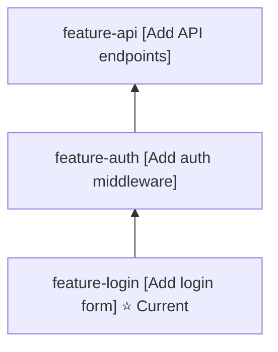

# jj PR Stack Tools

Tools for managing and visualizing Jujutsu (jj) commit stacks in GitHub Pull Requests.

## Overview

This toolkit provides two main utilities:

1. **jj-mermaid.sh** - Generate Mermaid diagrams of your commit stack
2. **jj-pr-stack.sh** - Automatically update all PRs in your stack with visual diagrams

## Features

- 🎨 **Visual Stack Representation** - Mermaid flowcharts show commit relationships
- 🔗 **Clickable PR Links** - Diagram nodes link directly to GitHub PRs
- 🔄 **Batch Updates** - Update all PRs in your stack with one command
- 🏃 **Dry Run Mode** - Preview changes before applying them
- ⭐ **Current Commit Highlighting** - See which commit you're working on
- 🚫 **Zero Dependencies** - Uses native jj templating and GitHub CLI

## Installation

The scripts are installed at:

- `~/.config/jj/scripts/jj-mermaid.sh`
- `~/.config/jj/scripts/jj-pr-stack.sh`

### Requirements

- [jj](https://github.com/martinvonz/jj) (Jujutsu version control)
- [gh](https://cli.github.com/) (GitHub CLI)

Make sure `gh` is authenticated:

```bash
gh auth login
```

## Usage

### From the Command Line

#### Generate Mermaid Diagram

```bash
# Generate diagram for current commit's stack
~/.config/jj/scripts/jj-mermaid.sh

# Generate for a specific commit
~/.config/jj/scripts/jj-mermaid.sh main~

# Copy to clipboard
~/.config/jj/scripts/jj-mermaid.sh @ | pbcopy  # macOS
~/.config/jj/scripts/jj-mermaid.sh @ | xclip   # Linux
```

#### Update All PRs in Stack

```bash
# Update all PRs with the stack diagram
~/.config/jj/scripts/jj-pr-stack.sh

# Preview without making changes
~/.config/jj/scripts/jj-pr-stack.sh @ --dry-run

# Update stack from a specific commit
~/.config/jj/scripts/jj-pr-stack.sh main~
```

### From jjui (Recommended)

Custom commands are configured in `~/.config/jjui/config.toml`:

| Key       | Command                   | Description                        |
| --------- | ------------------------- | ---------------------------------- |
| `M`       | Generate Mermaid          | Create diagram for selected commit |
| `P`       | Update PR Stack           | Update all PRs with stack diagram  |
| `Shift+P` | Update PR Stack (Dry Run) | Preview updates without applying   |

### Usage Tips

1. **Navigate to any commit** in your stack using jjui
2. **Press `M`** to see the Mermaid diagram for that commit's stack
3. **Press `P`** to update all PRs in the stack with the diagram
4. **Use `Shift+P`** first to preview what will be updated

## How It Works

### Stack Detection

The tools use jj's revset query language to detect your stack:

```
(::COMMIT | COMMIT::) ~ root()
```

This finds all ancestors and descendants of the target commit, excluding the root.

### PR Discovery

For each commit with bookmarks (branches), the tool:

1. Queries GitHub for PRs matching the bookmark name
2. Extracts PR URLs and numbers
3. Creates clickable Mermaid nodes

### PR Description Updates

The diagram is inserted into PR descriptions between HTML comment markers:

```markdown
<!-- jj-stack-start -->

## PR Stack

[Mermaid diagram here]

<!-- jj-stack-end -->
```

Subsequent updates replace the content between these markers, preserving the rest of your PR description.

## Example Output



## Troubleshooting

### "gh is not authenticated"

Run `gh auth login` and follow the prompts.

### "No PRs found in the stack"

Make sure:

- Your commits have bookmarks (branches)
- PRs exist for those branches on GitHub
- You're in a repository with a GitHub remote

### Quote Escaping Issues

If your commit messages contain quotes, they are automatically escaped. If you see rendering issues in GitHub, the Mermaid syntax may need adjustment.

### Scripts Not Found

Verify the scripts exist and are executable:

```bash
ls -lh ~/.config/jj/scripts/
chmod +x ~/.config/jj/scripts/*.sh
```

## Configuration Files

### jjui Config (~/.config/jjui/config.toml)

```toml
[ui.tracer]
enabled = true

[custom_commands]
"pr view/create current" = { key = ["/"], args = ["pr", "-r", "$change_id"], show = "interactive" }
"generate mermaid" = { key = ["M"], args = ["util", "exec", "--", "~/.config/jj/scripts/jj-mermaid.sh", "$change_id"], show = "output" }
"update pr stack" = { key = ["P"], args = ["util", "exec", "--", "~/.config/jj/scripts/jj-pr-stack.sh", "$change_id"], show = "output" }
"update pr stack (dry-run)" = { key = ["shift+p"], args = ["util", "exec", "--", "~/.config/jj/scripts/jj-pr-stack.sh", "$change_id", "--dry-run"], show = "output" }
```

## Advanced Usage

### Custom Revsets

You can modify the stack revset in the scripts to customize what's included:

```bash
# Only show commits with bookmarks
local stack_revset="((::${commit_ref} | ${commit_ref}::) ~ root()) & bookmarks()"

# Only show commits up to main
local stack_revset="::${commit_ref} ~ ::main"
```

### Integration with CI/CD

You can automate PR updates on push:

```yaml
# .github/workflows/update-pr-stack.yml
name: Update PR Stack Diagram
on:
  pull_request:
    types: [opened, synchronize]

jobs:
  update:
    runs-on: ubuntu-latest
    steps:
      - uses: actions/checkout@v3
      - name: Install jj
        run: cargo install jj-cli
      - name: Update PR Stack
        env:
          GH_TOKEN: ${{ secrets.GITHUB_TOKEN }}
        run: ~/.config/jj/scripts/jj-pr-stack.sh @
```

## Design Philosophy

This tool follows the principle of **zero-dependency, native integration**:

- ✅ Uses jj's built-in templating and revset queries
- ✅ Uses GitHub's official CLI tool
- ✅ No external stack managers or databases
- ✅ No forced workflow patterns (no base PRs required)
- ✅ Works with your existing jj workflow

## Contributing

To enhance these tools:

1. Edit the scripts in `~/.config/jj/scripts/`
2. Test with `--dry-run` mode
3. Share improvements via GitHub Gists or Issues

## License

These scripts are provided as-is for personal use. Feel free to modify and distribute.
